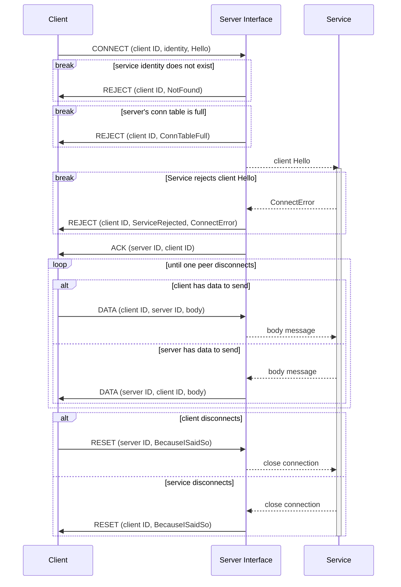

```mermaid
sequenceDiagram
    participant Client
    participant Server as Server Interface
    participant Service
    Client->>Server: CONNECT (client ID, identity, Hello)
    break service identity does not exist
        Server->>Client: REJECT (client ID, NotFound)
    end
    break server's conn table is full
        Server->>Client: REJECT (client ID, ConnTableFull)
    end
    Server-->>Service: client Hello
    activate Service
    break Service rejects client Hello
        Service-->>Server: ConnectError
        Server->>Client: REJECT (client ID, ServiceRejected, ConnectError)
    end
    Server->>Client: ACK (server ID, client ID)
    loop until one peer disconnects
        alt client has data to send
            Client->>Server: DATA (client ID, server ID, body)
            Server-->>Service: body message
        else server has data to send
            Service-->>Server: body message
            Server->>Client: DATA (server ID, client ID, body)
        end
    end
    alt client disconnects
        Client->>Server: RESET (server ID, BecauseISaidSo)
        Server-->>Service: close connection
    else service disconnects
        Service-->>Server: close connection
        Server->>Client: RESET (client ID, BecauseISaidSo)
    end
    deactivate Service
```